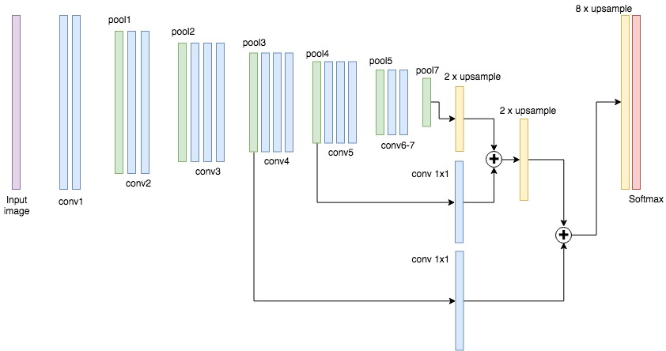
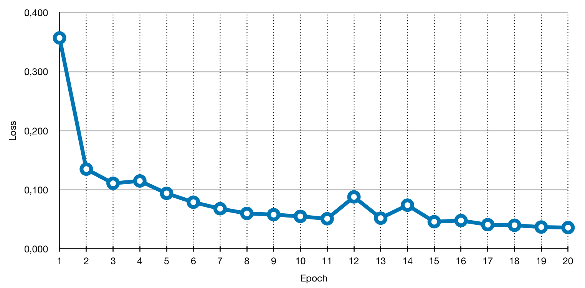

# Semantic Segmentation
### Introduction
In this project, you'll label the pixels of a road in images using a Fully Convolutional Network (FCN).

### Setup
##### GPU
`main.py` will check to make sure you are using GPU - if you don't have a GPU on your system, you can use AWS or another cloud computing platform.
##### Frameworks and Packages
Make sure you have the following is installed:
 - [Python 3](https://www.python.org/)
 - [TensorFlow](https://www.tensorflow.org/)
 - [NumPy](http://www.numpy.org/)
 - [SciPy](https://www.scipy.org/)
##### Dataset
Download the [Kitti Road dataset](http://www.cvlibs.net/datasets/kitti/eval_road.php) from [here](http://www.cvlibs.net/download.php?file=data_road.zip).  Extract the dataset in the `data` folder.  This will create the folder `data_road` with all the training a test images.

### Start
##### Implement
Implement the code in the `main.py` module indicated by the "TODO" comments.
The comments indicated with "OPTIONAL" tag are not required to complete.
##### Run
Run the following command to run the project:
```
python main.py
```
**Note** If running this in Jupyter Notebook system messages, such as those regarding test status, may appear in the terminal rather than the notebook.

### Submission
1. Ensure you've passed all the unit tests.
2. Ensure you pass all points on [the rubric](https://review.udacity.com/#!/rubrics/989/view).
3. Submit the following in a zip file.
 - `helper.py`
 - `main.py`
 - `project_tests.py`
 - Newest inference images from `runs` folder  (**all images from the most recent run**)
 
 ### Tips
- The link for the frozen `VGG16` model is hardcoded into `helper.py`.  The model can be found [here](https://s3-us-west-1.amazonaws.com/udacity-selfdrivingcar/vgg.zip)
- The model is not vanilla `VGG16`, but a fully convolutional version, which already contains the 1x1 convolutions to replace the fully connected layers. Please see this [forum post](https://discussions.udacity.com/t/here-is-some-advice-and-clarifications-about-the-semantic-segmentation-project/403100/8?u=subodh.malgonde) for more information.  A summary of additional points, follow. 
- The original FCN-8s was trained in stages. The authors later uploaded a version that was trained all at once to their GitHub repo.  The version in the GitHub repo has one important difference: The outputs of pooling layers 3 and 4 are scaled before they are fed into the 1x1 convolutions.  As a result, some students have found that the model learns much better with the scaling layers included. The model may not converge substantially faster, but may reach a higher IoU and accuracy. 
- When adding l2-regularization, setting a regularizer in the arguments of the `tf.layers` is not enough. Regularization loss terms must be manually added to your loss function. otherwise regularization is not implemented.
 
## [Rubric](https://review.udacity.com/#!/rubrics/989/view) points

### Build the Neural Network

This project implements a road pixel-by-pixel semantic segmentation with a help of a Fully Convolutional Network (FCN). A pre-trained VGG16 network is used with a decoder implementation based on the [Fully Convolutional Networks for Semantic Segmentation](https://arxiv.org/abs/1605.06211) paper from UC Berkeley. The architecture of the network is presented bellow.



#### Does the project load the pretrained vgg model?

Loading of the model is implemented in `load_vgg` function in [lines 23 through 50](./main.py#L23) of `main.py`.

#### Does the project learn the correct features from the images?

Layers are connected as described in the project walkthrough and the original [paper](https://arxiv.org/abs/1605.06211). The `layers` function implememntation can be found in [lines 54 through 94](./main.py#L54) of `main.py`.

#### Does the project optimize the neural network?

The network is optimized with a help of [AdamOptimizer](https://www.tensorflow.org/api_docs/python/tf/train/AdamOptimizer) based on the cross entropy loss as a loss function. The implementation can be found in `optimize` function in [lines 98 through 119](./main.py#L98) of `main.py`.

#### Does the project train the neural network?

Training is implemented in function `train_nn` in [lines 123 through 178](./main.py#L123) of `main.py`. Additionally a `learning_log.csv' file is created containing average loos per each epoch run.

### Neural Network Training

#### Does the project train the model correctly?

The average cross entropy loss quickly reduces at each epoch run reaching bellow 10% already at 5th epoch run. One such run example with a batch size of 2, dropout 25%, and learning rate 1e-4 is shouwn bellow.



#### Does the project use reasonable hyperparameters?

I found that batch size 2 and number of epochs 20 give me satisfactory results on test images as well as on a video stream. Training the network with such hyperparameters takes a bit less then 30 min on an AWS's  `g3.4xlarge` spot instance. It is a bit more than a minute per epoch. 

#### Does the project correctly label the road?

The project labels most pixels of roads close to the best solution. There are some problematic images though where using image augmentation helped to improve already the classification to a certain extend. One example of such a performance is shown below. Image flip and random in range [-200:200] pixels horisontal and [-60:60] pixels vertical shift transformation augmentations were applied to random images. The augmentation implementation is added to the `helper.py` function `get_batches_fn` in [lines 92 through 103](./helper.py#L91).  All the images of the run are provided in [run_e20_b2_kp0.75_lr0.0001_aug_flip0.3_transl60_200.zip](./run_e20_b2_kp0.75_lr0.0001_aug_flip0.3_transl60_200.zip) archive.


### Applying network to a video stream

Additionally to verifying on test images, I applied the FCN on a video stream from one of challenge videos of previous projects. Although the performance is not great, the model still performs reasonably well in most of the non-problematic areas. Further improvement are definately possible by extending the augmentation to contrast and brightness as well as using additional training datasets. 


